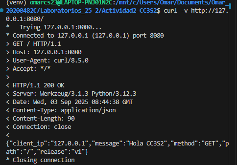

#Reporte de evidencias
*Usuario:* omarcs23
#1.HTTP
##1.1 Levantar la app: 
Usando vscode y python se corre app.py y se realiza la solicitud HTTP mediante el servidor Flask

##1.2 Inspección con curl:
Dejando abierto la terminal con las variables de entorno PORT="8080" MESSAGE="Hola CC3S2" RELEASE="v1" abrimos otra y usando la petición directa.
Usando el comando curl -v http://127.0.0.1:8080/

Por otro lado con el otro comando curl -i -X POST http://127.0.0.1:8080/
Se observa que HTTP distingue método y ruta. Es más el servidor comunica claramente y amigablemete que solo permite el GET.

##1.3 Puertos abiertos con ss:
La aplicación está activa y escuchando en el puerto correcto(8080) y el port bibding del 12-factor está funcionando.

#2.DNS
##2.1 Comprueba Resolución:
/etc/hosts es una resolución local  y una zona DNS autoritativa es una resolución global que se puede acceder desde cualquier cliente que consulte ese DNS. Esta práctica nos permitió simular ejemplos de dominios que para nuestro caso es miapp.local sin afectar el DNS público.

