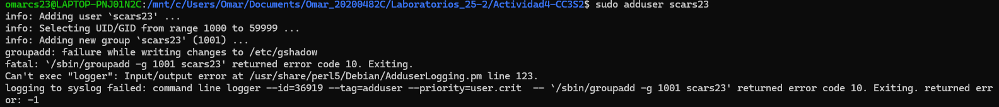

# Actividad 4: Introducción a herramientas CLI en entornos Unix-like para DevSecOps

Esta tarea está diseñado para el manejo de la línea de comandos (CLI) en sistemas Unix-like.

## Requisitos previos

- Acceso a un sistema Unix-like (Ubuntu, macOS o Linux nativo).  
- Para Windows: instalar WSL2 con Ubuntu y verificar el setup con `wsl.exe --version` y `cat /etc/os-release`.  
- Terminal de Ubuntu: Ctrl+Alt+T o buscar "Terminal".  
- Permisos de superusuario: usar `sudo` cuando sea necesario.

## Preparación para evidencias y evaluación

- Todos los entregables en `Actividad4-CC3S2
---

## Sección 1: Manejo sólido de CLI

### Riesgo & mitigación

- **Riesgo:** Errores en navegación o manipulación masiva pueden provocar pérdida de datos o exposición.  
- **Mitigación:** Usar opciones seguras como `--`, `-print0/-0` en `find/xargs`, y dry-run (`echo`) para pruebas. Evitar operaciones recursivas en `/`.

### Marco teórico

La CLI permite interactuar con el sistema operativo mediante texto. Es esencial para:

- Scripting y automatización CI/CD.  
- Auditoría de seguridad y escaneo de vulnerabilidades.  

Conceptos clave:

- **Navegación:** movernos por directorios y archivos.  
- **Globbing:** patrones como `*`, `?` y `[ ]`.  
- **Tuberías (pipes):** `|` para encadenar comandos.  
- **Redirecciones:** `>`, `>>`, `<`, `2>` para manejar entrada/salida.  
- **xargs:** convierte salida de un comando en argumentos para otro.

### Explicaciones paso a paso

#### Navegación básica

- `pwd` → muestra el directorio actual.  
- `ls` → lista archivos y directorios.  
- `ls -l` → formato largo (permisos, dueño, tamaño).  
- `ls -a` → incluye archivos ocultos.  
- `cd /` → va al root.  
- `cd ~` → va al home.  
- `cd ..` → sube un nivel.  

#### Globbing

- `ls *.txt` → lista archivos terminados en `.txt`.  
- `touch archivo1.txt archivo2.txt archivo3.doc` → crea archivos de prueba.  
- `ls archivo*.txt` → muestra `archivo1.txt` y `archivo2.txt`.  

#### Tuberías (Pipes)

- `ls | wc -l` → cuenta archivos (sin ocultos).  
- `ls -A | wc -l` → cuenta incluyendo ocultos.  

#### Redirecciones

- `>` → sobrescribe salida: `ls > lista.txt`.  
- `>>` → agrega salida: `printf "Hola\n" >> lista.txt`.  
- `<` → entrada desde archivo: `wc -l < lista.txt`.  
- `2>` → errores: `ls noexiste 2> errores.txt`.  

#### xargs

- `find . -maxdepth 1 -name 'archivo*.txt' -print0 | xargs -0 rm --` → borrado seguro.  
- `echo "archivo1.txt archivo2.txt" | xargs rm` → cuidado, usar con `echo` para dry-run.  

### Ejercicios de reforzamiento

- `cd /etc; ls -a > ~/etc_lista.txt` → redirige listado de archivos ocultos.  
- `find /tmp -maxdepth 1 -type f \( -name '*.txt' -o -name '*.doc' \) | wc -l` → cuenta archivos `.txt` y `.doc`.  
- `printf "Línea1\nLínea2\n" > test.txt` → crea archivo.  
- `ls noexiste 2>> errores.log` → redirige errores.  
- `find . -maxdepth 1 -name 'archivo*.txt' | xargs echo rm` → dry-run para borrado.  
- Comprobación: `nl test.txt` y `wc -l lista.txt`.

---

## Sección 2: Administración básica

### Riesgo & mitigación

- **Riesgo:** Over-permission puede exponer datos sensibles.  
- **Mitigación:** umask 027, evita operaciones recursivas en `/`, señales controladas con `kill`.  

### Marco teórico

- **Usuarios/Grupos/Permisos:** control de accesos, principio de menor privilegio.  
- **Procesos/Señales:** monitoreo y control de ejecuciones.  
- **systemd:** gestor de servicios moderno.  
- **journalctl:** auditoría y logs de servicios.  

### Explicaciones paso a paso

#### Usuarios/Grupos/Permisos

- `whoami` → usuario actual.

- `id` → UID, GID y grupos.  
- Crear usuario: `sudo adduser nuevouser`.  
- Crear grupo y agregar usuario: `sudo addgroup nuevogrupo; sudo usermod -aG nuevogrupo nuevouser`.  
- Cambiar permisos: `chmod 644 archivo`.  
- Cambiar dueño: `sudo chown nuevouser:nuevogrupo archivo`.

#### Procesos/Señales

- `ps aux` → lista procesos.  
- `top` → monitor interactivo.  
- Terminar proceso: `kill -SIGTERM PID`.  
- Forzar terminación: `kill -9 PID`.

#### systemd

- Ver estado: `systemctl status ssh`.  
- Iniciar/parar servicio: `sudo systemctl start/stop servicio`.  
- Habilitar al boot: `sudo systemctl enable servicio`.  

#### journalctl

- Logs de servicio: `journalctl -u servicio`.  
- Seguir logs en tiempo real: `journalctl -f`.  
- Desde fecha específica: `journalctl --since "2025-08-29"`.  

### Ejercicios de reforzamiento

- Crear usuario y grupo: `sudo adduser devsec; sudo addgroup ops; sudo usermod -aG ops devsec; touch secreto.txt; sudo chown devsec:ops secreto.txt; sudo chmod 640 secreto.txt`.  
- Listar procesos: `ps aux | grep bash`.  
- Ver servicio: `systemctl status systemd-logind`.  
- Iniciar proceso en background: `sleep 100 &` → matar con `kill`.

#### Comprobación

- `namei -l secreto.txt` → verifica permisos.  
- `id devsec` → confirma grupos.

---

## Sección 3: Utilidades de texto de Unix

### Riesgo & mitigación

- **Riesgo:** Procesamiento de logs puede exponer datos o causar borrados.  
- **Mitigación:** filtros como `journalctl -p err..alert`, rotación de logs, opciones seguras en `find/xargs` (`-i`, `--`).

### Marco teórico

- **grep:** buscar patrones.  
- **sed:** editar streams (reemplazar, eliminar).  
- **awk:** procesar columnas.  
- **cut:** extraer campos.  
- **sort/uniq:** ordenar y eliminar duplicados.  
- **tr:** traducir caracteres.  
- **tee:** mostrar y guardar salida.  
- **find:** buscar archivos.  

### Explicaciones paso a paso

- `grep patrón archivo` → buscar texto.  
- `sed 's/viejo/nuevo/' archivo` → sustituir texto.  
- `awk '{print $1}' archivo` → imprime primera columna.  
- `cut -d: -f1 /etc/passwd` → primera columna separada por `:`.  
- `sort archivo | uniq` → ordenar y quitar duplicados.  
- `tr 'a-z' 'A-Z' < archivo` → convertir a mayúsculas.  
- `comando | tee archivo` → muestra y guarda.  
- `find /directorio -name "*.txt"` → busca archivos.

### Ejercicios de reforzamiento

- `grep root /etc/passwd` → buscar "root".  
- `sed 's/dato1/secreto/' datos.txt > nuevo.txt` → reemplazar dato1.  
- `awk -F: '{print $1}' /etc/passwd | sort | uniq` → extraer usuarios.  
- `printf "hola\n" | tr 'a-z' 'A-Z' | tee mayus.txt` → mayúsculas y guardar.  
- `find /tmp -mtime -5 -type f` → archivos modificados últimos 5 días.  
- Pipeline completo: `ls /etc | grep conf | sort | tee lista_conf.txt | wc -l`.  
- Auditoría: `

