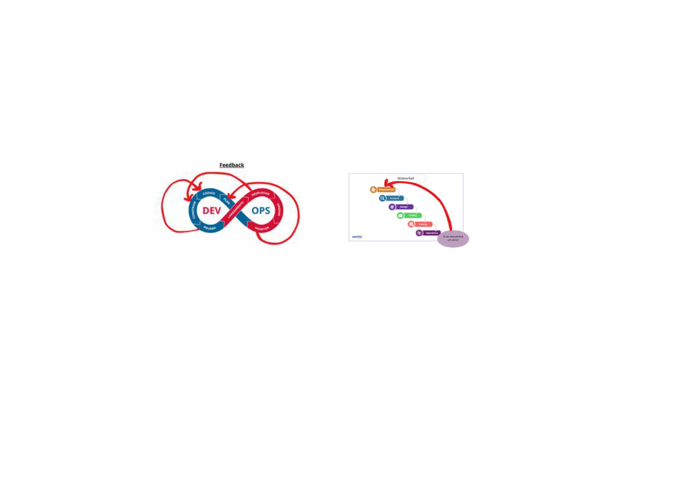

#Laboratorios 25-2
##Omar Ailton Ccahuana Sosa
Fecha: 2025-08-26
Tiempo invertido: 00:00

Contexto: Trabajo realizado en mi PC personal con sistema operativo Windows, usando Git y GitHub.
# Actividad 1 - CC3S2
**Autor:** Omar Ailton Ccahuana Sosa  
**Fecha:** 26/08/2025  
**Tiempo invertido:** 03:00  

---

## Entorno de trabajo
La actividad fue desarrollada en un entorno con Git, GitHub y editor de texto en terminal (Nano en Git Bash sobre Windows 10). Se usaron herramientas básicas de línea de comandos para versionar, organizar y documentar el trabajo.  

---

## 4) Contenido a desarrollar

### 4.1 DevOps vs. cascada tradicional
**Comparación general:**  
Debido a varias carácterísticas del modelo cascada(waterfall) tradicional entre ellas lo secuencial o lineal y el tener los procesos del desarrollo del software aislados, el modelo DevOps o mejor descrito como cultura DevOps. Que al contrario, iterativo - continuo y además que facilitaba la coordinación y colaboración debido a que en este último si trabajaban juntEs más DevOps surgió gracias a las deficiencias del modelo Cascada.

**Imagen comparativa:**  

**Ventajas de DevOps frente a cascada:**  
- Feedback de manera continua y frecuente
- Asegurar despliegues más seguros y rápidos, acelerando el ciclo de vida.
- El riesgo en cada trenga será menor, ya que se hacen pequeños cambios, pequeños lotes y no a todo el proyecto.  
- Colaboración directa entre Dev, Ops y QA.  

**Pregunta retadora:**  
Un contexto donde el modelo cascada aún puede ser razonable es en sistemas críticos con certificación regulatoria (ej. software médico en dispositivos de hardware especializado).  

**¿Por qué DevOps acelera y reduce el riesgo en software para la nube frente a cascada?**
- Cascada es secuencial, asi que si se detecta un error va a tener que ser al final y se tendría que rehacer fases completas. En cambio DevOps gracias a CI los errores se detectan casi al mismo tiempo que el desarrollador sube código.
- En cascada se esperan varios meses para poder lanzar una versión con muchos cambios, lo que nos lleva a que sea más dificil de detectar que cambio causó el problema.En cambio en DevOps las pruebas y los despliegues son pequeños y frecuentes, logrando hacerse varios despliegues en un solo día, acelerando las cosas.
- En cascada muchas tareas como el despliegue, configuración de servidores y pruebas suelen ser manuales, como consecuencia resultan lentas y con errores. En cambio en DevOps la nube permite automatizar todo el ciclo de vida con pipelines CI/CD y scripts de infraestructura como código.

Todos estos puntos nos lleva a concluir que DevOps acelera el desarrollo en la nube porque nos entrega valor en ciclos cortos, con retroalimentación inmediata y todas las tareas automatizadas.Esto reduce el riesgo al evitar que todo los errores se acumulen y se vuelvan un gran problema al final, asegurandonos rapidez y eficiencia en producción.Todo lo contrario al modelo cascada.
**Criterios verificables:**  
1. **Conformidad regulatoria**: requiere trazabilidad completa de cada etapa y aprobación formal antes de avanzar.  
2. **Acoplamiento con hardware**: los cambios en software están limitados por pruebas costosas en dispositivos físicos.  

**Trade-offs:**  
- **Velocidad**: mucho más lenta en comparación con DevOps.  
- **Conformidad/seguridad**: más sólida porque cada etapa se documenta y valida de manera estricta.  

---

### 4.2 Ciclo tradicional de dos pasos y silos (limitaciones y anti-patrones)
El flujo se divide en 2 pasos.  
1. **Dev**: Los equipos generan el código, pruebas unitarias y entregan un paquete terminado.
2. **Ops**: Se encargan del despliegue, configuración y mantenimiento en producción.

Estos 2 paso ocurren en silos organizacionales, es decir en aislamiento, donde cada grupo trabaja por su cuenta, con poca retroalimentación y objetivos independientes.

**Imagen ilustrativa:**  

**Limitaciones identificadas:**  
1. **Gran entrega**: la acumulación de cambios provoca mayor riesgo de fallos masivos en producción.  
2. **Comunicación deficiente**:El equipo de desarrollo buscará velocidad, en cambio el equipo de operaciones lo que busca es la estabilidad del software.  
3. Los despliegues son manuales y no se realizarán con frecuencia.

**Pregunta retadora (anti-patrones):**  
Para comenzar antipatrones son en simples palabras, malas prácticas que engañan al desarrollador como si fuesen buenas pero al final resultan perjudiciales.
- **Throw over the wall**: Es un antipatrón de gestión de proyectos, donde una de las fases al culminar "avienta abruptamente" y sin colaboración al siguiente equipo.Este modelo se adhiere al modelo cascada. Provoca consecuencias como los siguientes ejemplos.
	1. Un error en el análisis de requisito se detecta en fase de testing haciendo tardío y costoso su corrección.  
	2. Provoca fricción en las distintas fase o equipos y se terminan "lanzando la pelota de la culpa" entre ellos.
- **Seguridad como auditoría tardía**: Este se puede definir como justamente la diferencia entre DevOps y DevSecOps, ya que auditoría tardía es lo que ocurre en DevOps toma la seguridad y no la integra si no la toma como un paso de control final y aislado, contrario a lo que se hace en DevSecOps donde la velocidad sin seguridad es inaceptable.  

**Consecuencias:**  
- **Mayor MTTR (Mean Time To Repair)**: Al no haber nada de colaboración entre las partes, se hace dificil saber la causa de la falla y por tanto toma más tiempo solucionarlas.  
- **Retrabajos y degradaciones repetitivas**: Al ser la seguridad una fase aislada que solo aparece al final, no logran descrubir el origen de la falla y esto provoca que al no eliminar el fallo desde raiz, este fallo vuelve a aparecer.  

---
# 4.3 Principios y beneficios de DevOps (CI/CD, automatización, colaboración; Agile como precursor)

### CI/CD
- **CI (Integración Continua):**
  - Cambios pequeños y frecuentes.
  - Pruebas automatizadas cercanas al código para detectar errores rápido.
  - Feedback continuo para desarrolladores.

- **CD (Entrega/Despliegue Continuo):**
  - Promoción automática hacia entornos superiores si pasan los gates.
  - Despliegues predecibles y reversibles.
  - Colaboración entre Dev y Ops para reducir fricción.

### Práctica Agile como precursor
- Ejemplo: **reuniones diarias (daily standup)** → detectan bloqueos que alimentan decisiones en el pipeline (qué promover o qué detener).
- Ejemplo: **retrospectivas** → ajustes en políticas del pipeline (ej. más pruebas automáticas si hubo fallos recurrentes).

### Indicador observable
- **Métrica propuesta:** tiempo promedio desde que un Pull Request queda listo hasta su despliegue en entorno de pruebas.
- **Recolección:**  
  - Revisar **metadatos de PRs** (timestamps de merge).  
  - Consultar **logs de despliegue** (hora de inicio del deployment).  
  - Calcular la diferencia (no requiere herramientas pagas, basta con bitácora + timestamps).

---

# 4.4 Evolución a DevSecOps (seguridad desde el inicio: SAST/DAST; cambio cultural)

### Diferencia SAST vs DAST
- **SAST (Static Application Security Testing):** análisis estático del código → temprano en el pipeline (antes de compilar).
- **DAST (Dynamic Application Security Testing):** pruebas en la aplicación en ejecución → en entornos de staging/test.

### Gate de seguridad con umbrales
- **Regla 1:** *Cualquier hallazgo crítico en componentes expuestos bloquea promoción*.  
- **Regla 2:** *Cobertura mínima de pruebas de seguridad ≥ 70%*.  

### Política de excepción
- Se permite excepción solo si:  
  - Tiene **fecha límite** (ej. 15 días).  
  - Hay **responsable asignado** (dueño del módulo).  
  - Existe un **plan de corrección documentado**.  

### Pregunta retadora: evitar "teatro de seguridad"
- **Señales de eficacia:**
  - Disminución de hallazgos repetidos → evidencia de aprendizaje.
  - Reducción del tiempo de remediación → evidencia de agilidad real.  
- **Medición:** comparar resultados de scans periódicos y tiempo entre hallazgo y fix.

---

# 4.5 CI/CD y estrategias de despliegue (sandbox, canary, azul/verde)

### Estrategia elegida
- **Canary Deployment**  
- Justificación: Imaginemos un microservicio de autenticación, Validar usuarios por ejemplo. Si tenemos una nueva versión, no podemos desplegarla de golpe porque se corre el riesgo de que miles de usuarios no puedan inciar sesión y que se caiga toda la plataforma.

### Riesgos y mitigaciones

| Riesgo                           | Mitigación                                          |
|----------------------------------|----------------------------------------------------|
| Datos de usuario desincronizados | Replicar en tiempo real y planificar la migración de datos
| Filtración de datos sensibles    | Enmascarar datos sensibles, rotar/limpiar logs          |
| Expiración de tokens             | Sincroniza NTP en todos los servicios y permite la validación de tiempo |

### KPI primario
- **Métrica:** error 5xx ≤ 1%  
- **V**
